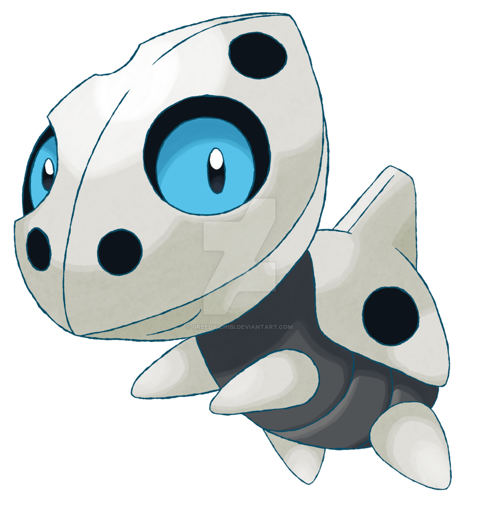

Just a little project in C#: it's basically a Tamagotchi with basic mechanics like feeding and sleeping, but with Pokémon. To build it, an Aron named Jax was used as a guinea pig so F in the chat for poor Jax!

